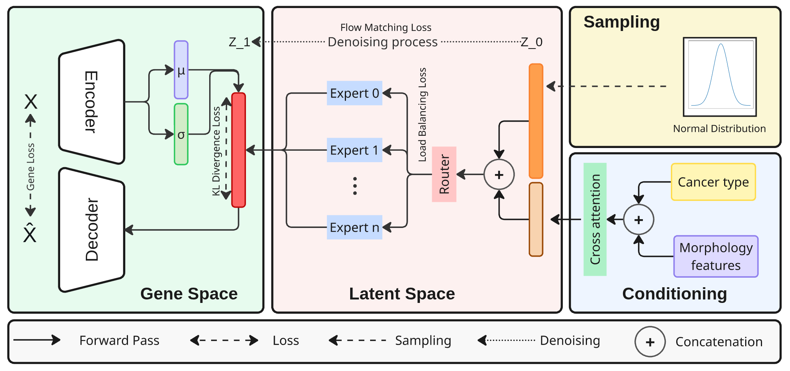

# [ICML 2026] MoLF — Mixture-of-Latent-Flow
### Pan-Cancer Spatial Gene Expression Prediction from Histology

[](http://arxiv.org/abs/2602.02282)
[](https://susuhu.github.io/MoLF/)
[](https://github.com/susuhu/MoLF)
---

**MoLF** is a next-generation generative framework for scalable **pan-cancer histogenomics**. It combines a **Mixture-of-Experts (MoE)** velocity field with **conditional Flow Matching** to predict spatial gene expression directly from standard H&E histology.

### ✨ Why MoLF?
* **Robust pan-cancer prediction** on the HEST-1k benchmark.
* **Expert-conditioned scaling** that routes tissue morphology through specialized latent flow experts.
* **Cross-species transfer** capability with strong Human → Mouse generalization.
* **Single-step latent transport** from noise to structured gene manifolds using an ODE-based flow.

> 💡 **Need low-compute, high-throughput precision for routine diagnostics?** 
> Check out our sister project, [HistoPrism](https://github.com/susuhu/HistoPrism)(ICLR 2026). While MoLF is built for exploratory robustness across diverse datasets, HistoPrism is highly optimized to deliver peak in-distribution accuracy for standardized human tissue screening and biomarker discovery.

### 🧠 Core Framework
1. **Latent Compression:** A Transformer-VAE compresses high-dimensional gene expression into a structured latent manifold.
2.  **Generative Flow:** A Conditional Flow Matching model, parameterized by an MoE velocity field, generates expressions conditioned on H&E patches.




## Folder Structure

Project top-level layout:

```
.
├─ gene_autoencoder_latent_visulization.py
├─ gene_autoencoder_train.py
├─ index.html
├─ LICENSE
├─ post_training_experts_analysis.py
├─ post_training_trajectory_analysis.py
├─ README.MD
├─ sampling.py
├─ train.py
├─ configs/
│  ├─ autoencoder_config_local.yml
│  ├─ autoencoder_config.yml
│  ├─ training_config_latent_moe_local.yml
│  └─ training_config_latent_moe.yml
├─ data/
│  ├─ Hallmark/
│  ├─ Hest_Bench/
│  └─ sample_processed_HEST1K/
├─ figures/
├─ gene_vae/
│  └─ ...
├─ models/
├─ training_log/
└─utils/
```

### Folder descriptions
- **`configs/`**: Configuration YAML files for VAE and flow training.
- **`data/`**: Preprocessed datasets (HEST1k, Hest_Bench, Hallmark gene sets) and split lists.
- **`figures/`**: Generated figures, overview diagrams, and assets used in the README/paper.
- **`gene_vae/`**: Outputs from gene VAE training (configs, checkpoints, UMAP embeddings and reducers).
- **`models/`**: Model definitions, baseline implementations, and architecture utilities.
- **`training_log/`**: Training run outputs and checkpoints, sampling/trajectory subfolders, and run configs.
- **`utils/`**: Helper modules for data loading, preprocessing, training utilities, and analysis tools.
- **Top-level scripts**: `train.py` (flow training), `gene_autoencoder_train.py` (VAE training), `sampling.py` (generate samples), `post_training_*` scripts (analysis & visualization).


## Quick Start
### 0.0 Data Preprocessing

- Download HEST1k from huggingface https://huggingface.co/datasets/MahmoodLab/hest. to `data/HEST1K` or [PATH/TO/YOUR/HEST1K]
- Please follow respective pathology foundation model (PFM) repositories for preprocessing. For example, preprocessed data with PFM [uni_v2](https://github.com/mahmoodlab/UNI) is in `data/sample_processed_HEST1K/univ2` with names `[sample_id]_embeddings.pt` which contains barcodes and correspongding uni features. This path is referred in `utils/custom_dataset.py` for dataloading.
- Also download hest_bench https://huggingface.co/datasets/MahmoodLab/hest-bench and put it in `data/Hest_Bench` [PATH/TO/YOUR/hest_bench] for fixed held-out test set and HVG-50 genes list
- Data split is merged from hest-bench and provided in `data/Hest_Bench/hest_pathway_clean_split_0` and `data/Hest_Bench/hest_pathway_clean_split_1`.


Following code could be used to preprocecss HEST1k dataset.

```
python3 utils/pfm_preprocesing.py
```

### 1.0 Trianing
- Stage 1 gene VAE
```
python3 gene_autoencoder_train.py -f configs/training_config_latent_moe.yml
```

- stage 2 latent flow matching 
```
python3 train.py -f configs/training_config_latent_moe.yml
```

Pretrained weights can also be downloaded from [huggingface](https://huggingface.co/HuSusu/MoLF).

### 2.0 Sampling
```
# test set sampling
python3 sampling.py -l training_log/run_20260506_162107_molf -g 2.0

# external mouse validation sampling
python3 sampling.py -l training_log/run_20260506_162107_molf -g 2.0 -e
```
### 3.0 Post-hoc analysis & visualization
#### 3.1 Gene VAE latent visualization

```
python3 gene_autoencoder_latent_visulization.py -l gene_vae/gene_vae_w_hvg_clean_split_0
```

#### 3.3 Latent flow trajectory analysis 
add flag with chosen cfg scale from previous step

```
python3 post_training_trajectory_analysis.py -l training_log/MoLF_split_0 -g 3.0
```

#### 3.3 Plot experts analysis

Given sampling dir, to plot experts utilization.

```
python3  post_training_experts_analysis.py -s training_log/MoLF_split_0/sampling_2euler_cfg_guidance_3.0_epoch158 -t training_log/MoLF_split_0/trajectory_2euler_cfg_guidance_3.0_epoch158
```

## License

This project is licensed under the **Creative Commons Attribution-NonCommercial 4.0 International License (CC BY-NC 4.0)**. For full details, see the [LICENSE](LICENSE) file.


### 📝 Citation
If you find our work useful, please consider cite us. 
```bibtex
@inproceedings{hu2026molf,
  author    = {Hu, Susu and Speidel, Stefanie},
  title     = {MoLF: Mixture-of-Latent-Flow for Pan-Cancer Spatial Gene Expression Prediction from Histology},
  booktitle = {Proceedings of the 43rd International Conference on Machine Learning (ICML)},
  year      = {2026},
  url       = {https://icml.cc/virtual/2026/poster/63940}
}